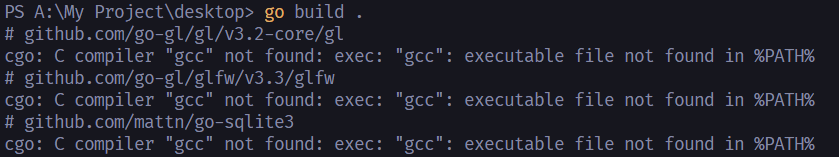

   

## Инструкция по использованию программы в ОС Linux через терминал:
1. Скачать язык Golang с официального сайта;
1. Скачать данный репозиторий удобным Вам способом:
   1. Используйте команаду `git clone https://github.com/DMoscicki/Task-Client.git`
   1. Либо скачайте zip архив из страницы репозитория
1. Перейдите в скаченную директорию через терминал или консоль и введите команду `go mod tidy`;
1. Для запуска приложения пропишите `go run main.go` или `go run .`.

## Инструкция по использованию программы в ОС Windows:

1. Скачать язык Golang с официального сайта;
1. Скачать данный репозиторий удобным Вам способом:
   1. Используйте команаду `git clone https://github.com/DMoscicki/Task-Client.git`
   1. Либо скачайте zip архив из страницы репозитория
1. Перейдите в скаченную директорию через терминал или консоль и введите команду `go mod tidy`;
1. Для запуска приложения пропишите `go run main.go` или `go run .` в терминале.

## Установка бинарника на ОС Linux:
1. Ввести и выполнить команду `fyne package -os linux -icon Icon.png` из директории проекта;
1. Распаковать из архива `*.tar.xz` содержимое папки `/bin` в корневую директорию;
1. Запустить файл.

## Установка бинарника на ОС Windows
1. Ввести и выполнить команду `fyne package -os windows -icon Icon.png` из директории проекта;
1. Запустить файл `*.exe`.

  
В случае возникновения ошибки компиляции

# Устранение ошибки компиляции:

## Если Вы видите данную ошибку необходимо:
1. Установить Mingw-w64 последней версии по этой [ссылке](https://github.com/msys2/msys2-installer/releases/download/2022-09-04/msys2-x86_64-20220904.exe);
1. Запустить установщик и установить MSYS2 в выбранную Вами директорию;
1. По окончанию установки установить флажок для запуска MSYS2;
1. В окне терминала вставить данную команду `pacman -S mingw-w64-x86_64-gcc` и запустить;
1. Добавить путь MSYS2 в переменную среду. Например: `"A:\msys64\mingw64\bin"`;
1. Перезайти во все терминалы для обновления `$PATH$`.
1. Снова запустить приложение `go run .` или `go main.go`

# Настройка почтового клиента:
Откройте в IDE (либо другом текстовом редакторе) файл `model/model.go` и поменяйте значения `SMTP HOST` и `PORT` **(строчка 530)** на те которые использует Ваш почтовый клиент. Параметры будут написаны на официальном сайте.
Потом в поле логина и пароля используйте адрес почты ***(test@example.org)*** и пароль от неё

## Обновление Базы Данных осуществляется с помощью генератора на языке [Python](https://github.com/DMoscicki/RandomData.git).
